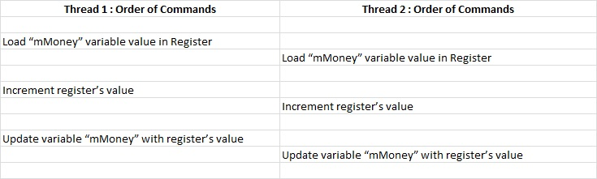

原文链接：https://thispointer.com//c11-multithreading-part-4-data-sharing-and-race-conditions/


多个线程共享数据很容易出问题，其中一个问题就是竞态条件。


### 什么是竞态条件?

竞态条件是多线程程序中的一种bug。

当两个或者多个线程并行的操作同一块内存的时候，其中一个或者多个线程改变了内存数据，有时候会导致不可预知的结果。

竞态条件问题一般很难查找和复现，因为它是偶发的，只有在特定的条件下出现。看个例子：

###  一个竞态条件的例子

假设有一个钱包类，内部维护了钱的总数，提供了一个方法addMoney()。addMoney()方法能增加钱包中的钱。

```c++
class Wallet
{
    int mMoney;
public:
    Wallet() :mMoney(0){}
    int getMoney() { return mMoney; }
    void addMoney(int money)
    {
       for(int i = 0; i < money; ++i)
       {
          mMoney++;
       }
    }
};
```

下边我们创建5个线程，共享一个钱包，每个线程使用addMoney()方法给钱包增加1000块钱。如果钱包中的钱一开始是0，当程序执行完毕的时候，钱包中的钱应该是5000。但是，由于竞态条件，有可能钱包中的钱少于5000.

```c++
int testMultithreadedWallet()
{
   Wallet walletObject;
   std::vector<std::thread> threads;
   for(int i = 0; i < 5; ++i){
        threads.push_back(std::thread(&Wallet::addMoney, &walletObject, 1000));
   }
   for(int i = 0; i < threads.size() ; i++)
   {
       threads.at(i).join();
   }
   return walletObject.getMoney();
}
int main()
{
  int val = 0;
  for(int k = 0; k < 1000; k++)
  {
     if((val = testMultithreadedWallet()) != 5000)
     {
       std::cout << "Error at count = "<<k<<" Money in Wallet = "<<val << std::endl;
     }
  }
  return 0;
}
```

输出：

```c++
Error at count = 971  Money in Wallet = 4568                                                                                                               Error at count = 971  Money in Wallet = 4568                                                                                                               Error at count = 972  Money in Wallet = 4260                                                                                                               Error at count = 972  Money in Wallet = 4260                                                                                                               Error at count = 973  Money in Wallet = 4976                                                                                                               Error at count = 973  Money in Wallet = 4976
```

这就是竞态条件的问题。

**这具体是什么原因呢？**

每一个线程并行的增加成员变量mMoney，尽管mMoney++只是一句代码，但是机器执行确是分3步执行的：

*  将mMoney加载到寄存器
* 增加寄存器的值
* 使用寄存器中的值更新mMoney的值

于是，在特定的场景下，机器执行的顺序可能是这样的：


在这种场景下，两个寄存器加载的mMoney值是相同的，然后各自自增1，然后各自写回内存，相当于mMoney只增加了一次。

这就是竞态条件。

### 如何修复竞态条件

需要使用锁的机制。每个线程在改变共享变量之前需要先获得一把锁，改变后释放锁。下篇文章将详细讲述锁的使用。