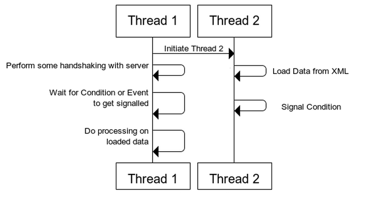

原文链接：https://thispointer.com//c11-multithreading-part-6-need-of-event-handling/


这篇文章主要介绍多线程的时间处理。

有时一个线程会等待一个事件发生，比如等待一个条件变成true，而促使这个条件变成true的是另外一个线程。

举个例子：

我们有一个基于网络的应用，这个程序做以下3件事:

（1）和服务端进行握手

（2）加载XML数据

（3）处理XML数据

（1）不依赖于任何任务，但是（3）依赖于（2）。因此，（1）和（2）可以使用不同线程并发从而提高效率。

现在，我们设计一下这个多线程应用。有两个线程，第一个线程的职责是：

* 和服务端进行握手
* 等待第二个线程加载XML文件
* 处理XML数据

第二个线程的职责是：

* 加载XML文件
* 通知第一个线程开始处理XML数据

两个线程的示意图如下：



在上图中，线程1进行一些操作然后等待一个事件发生，等待的事件就是XML数据加载成功。一旦线程1收到了事件的通知，就开始处理数据。

在线程2中，加载XML文件和线程1的和服务端握手是同步进行的。当线程2加载XML文件成功后，通知线程1。然后线程1开始处理XML数据。

这种多线程的好处是什么？

如果线程1和服务端握手需要很长时间，那么线程2同时可以加载XML文件，提高应用的效率。

第一种方案：

设置一个bool全局变量，默认值是false。当线程2完成XML加载的时候，设置为true。线程1不停的检查这个值是否为true，如果为true，就开始处理数据。因为两个线程同时访问一个全局变量，因此需要加锁。

```c++
#include<iostream>
#include<thread>
#include<mutex>
class Application
{
 std::mutex m_mutex;
 bool m_bDataLoaded;
public:
 Application()
 {
 m_bDataLoaded = false;
 }
 void loadData()
 {
 // Make This Thread sleep for 1 Second
 std::this_thread::sleep_for(std::chrono::milliseconds(1000));
 std::cout<<"Loading Data from XML"<<std::endl;
 // Lock The Data structure
 std::lock_guard<std::mutex> guard(m_mutex);
 // Set the flag to true, means data is loaded
 m_bDataLoaded = true;
 }
 void mainTask()
 {
 std::cout<<"Do Some Handshaking"<<std::endl;
 // Acquire the Lock
 m_mutex.lock();
 // Check if flag is set to true or not
 while(m_bDataLoaded != true)
 {
  // Release the lock
  m_mutex.unlock();
  //sleep for 100 milli seconds
  std::this_thread::sleep_for(std::chrono::milliseconds(100));
  // Acquire the lock
  m_mutex.lock();
  }
  // Release the lock
  m_mutex.unlock();
  //Doc processing on loaded Data
  std::cout<<"Do Processing On loaded Data"<<std::endl;
 }
};
int main()
{
  Application app;
  std::thread thread_1(&Application::mainTask, &app);
  std::thread thread_2(&Application::loadData, &app);
  thread_2.join();
  thread_1.join();
  return 0;
}
```


这个方案有如下缺点，

线程1不停的获取锁然后释放锁，将增加CPU开销。

如果我们能让线程1只是等待，线程2完成后通知线程1开始处理XML数据，将会大大减少CPU的开销，提升效率。这就是我们的方案2


第二种方案

使用条件变量。

条件变量是两个线程通信的一种方式。一个线程等待这个条件，另外一个线程触发这个条件。下一篇文章将讲述如何使用条件变量。

