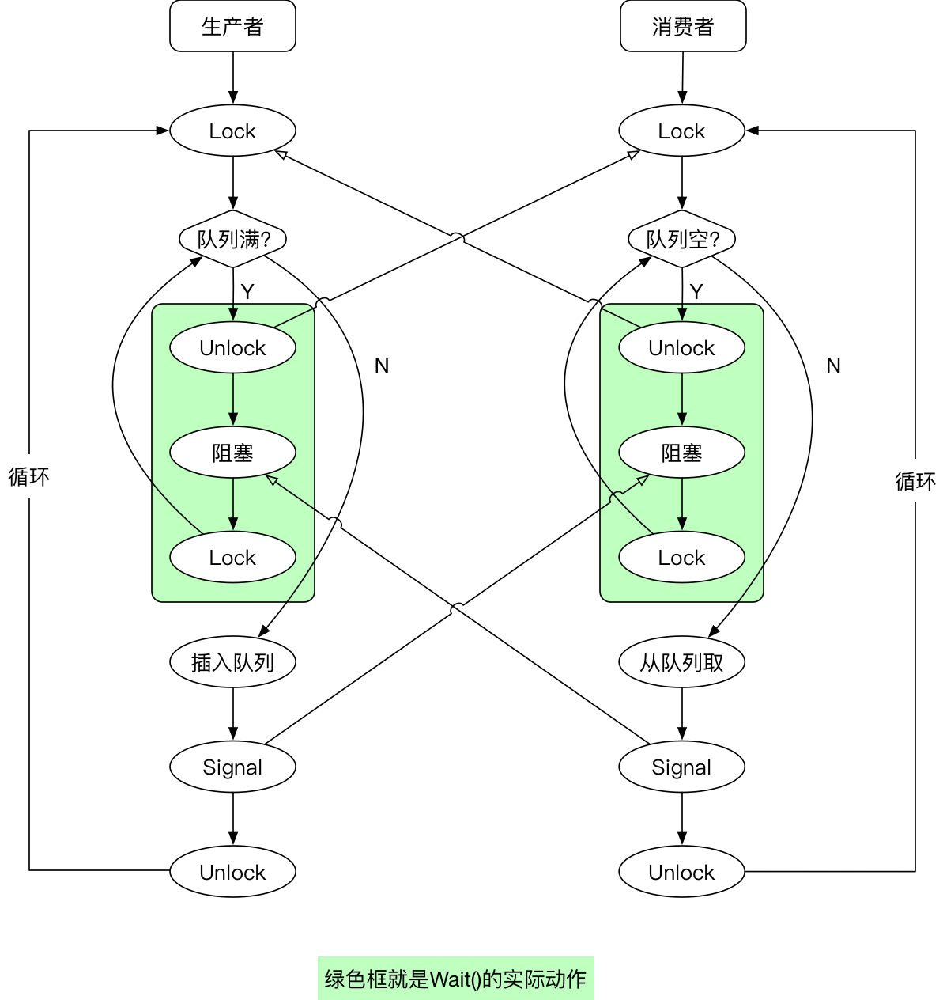

原文链接：https://thispointer.com//c11-multithreading-part-7-condition-variables-explained/


这篇文章讲述如何使用条件变量。


### 条件变量

条件变量是一种事件，用于两个线程之间的通信。一个线程等待，另外一个线程触发。

在C++11中使用条件变量需要的头文件：

```c++
#include <condition_variable>
```

使用条件变量的同时还需要使用mutex.

**条件变量是如何工作的**

* 线程1调用条件变量的wait方法等待。wait方法的内部获取了一个mutex，然后检查是否满足条件。
* 如果不满足条件，将释放锁，然后等待条件事件发生（线程阻塞）。wait()方法保证了这些操作的原子性。
* 当条件满足时，线程2触发条件事件。
* 线程1被事件唤醒，然后获取mutex锁，然后检查条件变量是否满足条件。如果满足条件将继续下边的逻辑，如果不满足条件将继续wait.
* 有多个线程wait的时候，一个signal只会解除一个线程的阻塞。


#### 译者添加的解释

条件变量的使用，其中绿色部分是wait()的内部：




 **wait()**

令当前线程阻塞，直到条件变量被触发。wait会自动释放关联的mutex锁，将当前线程添加到条件变量的等待列表中。如果有线程调用了条件变量的 calls notify_one() or notify_all()，等待列表中的线程有可能会被唤醒。

当线程被唤醒时，wait()会获取mutex锁，然后再检查条件是否满足。如果条件不满足，将释放mutex锁，再次阻塞当前线程。


**notify_one()**

notify_one唤醒等待列表中的一个线程。


**notify_all()**

notify_all将唤醒等待列表中的所有线程。


继续上一篇文章的例子：

方案2：

```c++
#include <iostream>
#include <thread>
#include <functional>
#include <mutex>
#include <condition_variable>
using namespace std::placeholders;
class Application
{
  std::mutex m_mutex;
  std::condition_variable m_condVar;
  bool m_bDataLoaded;
public:
  Application()
  {
    m_bDataLoaded = false;
  }
  void loadData()
  {
   // Make This Thread sleep for 1 Second
   std::this_thread::sleep_for(std::chrono::milliseconds(1000));
   std::cout<<"Loading Data from XML"<<std::endl;
   // Lock The Data structure
   std::lock_guard<std::mutex> guard(m_mutex);
   // Set the flag to true, means data is loaded
   m_bDataLoaded = true;
   // Notify the condition variable
   m_condVar.notify_one();
  }
  bool isDataLoaded()
  {
    return m_bDataLoaded;
  }
  void mainTask()
  {
    std::cout<<"Do Some Handshaking"<<std::endl;
    // Acquire the lock
    std::unique_lock<std::mutex> mlock(m_mutex);
    // Start waiting for the Condition Variable to get signaled
    // Wait() will internally release the lock and make the thread to block
    // As soon as condition variable get signaled, resume the thread and
    // again acquire the lock. Then check if condition is met or not
    // If condition is met then continue else again go in wait.
    m_condVar.wait(mlock, std::bind(&Application::isDataLoaded, this));
    std::cout<<"Do Processing On loaded Data"<<std::endl;
  }
};
int main()
{
   Application app;
   std::thread thread_1(&Application::mainTask, &app);
   std::thread thread_2(&Application::loadData, &app);
   thread_2.join();
   thread_1.join();
   return 0;
}
```


疑问：

什么是spurious call？


> 译者：这篇文章讲的不好，不看也罢！看明白译者的配图就行了。